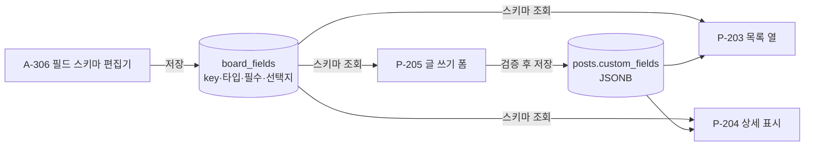
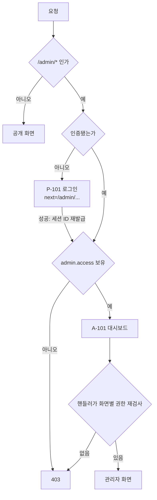
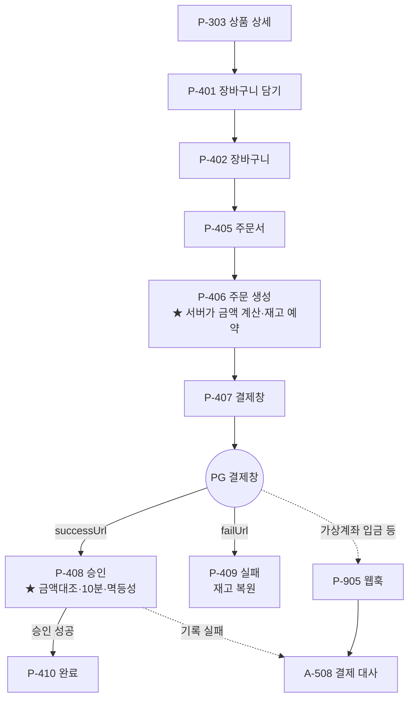
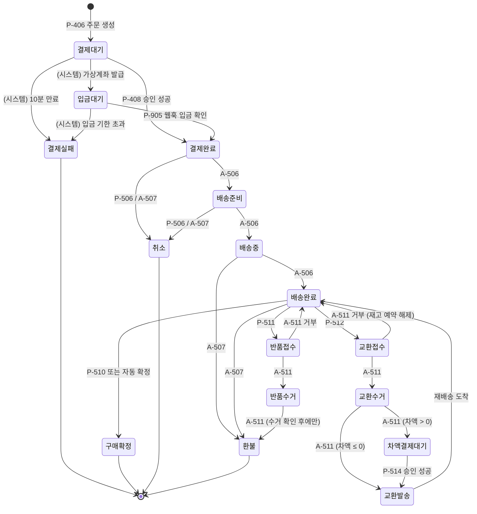

# D14. 화면 연계와 흐름

화면 목록은 [D11](11-screens.md), 상세는 [D12](12-screens-public.md)/[D13](13-screens-admin.md).
이 문서는 **관리자가 무엇을 바꾸면 공개 화면의 무엇이 달라지는가**와 상태 전이를 다룬다.

## 1. 지배 구조

```
관리자 화면(A-###)  ──정의──▶  데이터  ──읽기──▶  공개 화면(P-###)
                                  │
                                  └──▶ 테마 템플릿이 렌더링
```

**공개 화면은 관리자가 만든 정의를 읽어 그릴 뿐이다.** 공개 화면에 하드코딩된 구조가 있으면
관리자 화면이 무의미해진다 — 게시판 필드를 추가했는데 폼이 안 바뀌면 그게 실패다.

---

## 2. 관리자 → 공개 연계 매트릭스

**이 표가 "관리자에서 뭘 바꾸면 어디가 달라지는지"의 단일 출처다.**

| 관리자 화면 | 정의하는 것 | 영향받는 공개 화면 |
|---|---|---|
| A-201 사이트 설정 | 사이트 이름, 기본 메타·OG | P-201, P-202, P-203, P-204, 전 화면의 `<head>` |
| A-202 테마 활성화 | 렌더링 템플릿 집합 | **전 공개 화면** |
| A-203 테마 업로드 | 디스크 테마 파일 | **전 공개 화면** (활성화 시) |
| A-204 메뉴 관리 | 내비게이션 트리 | 전 공개 화면의 메뉴 |
| A-205 메일 발송 설정 | SMTP 자격증명·발신 주소 | **P-104** (설정이 없으면 재설정 메일이 안 나간다) |
| A-206 소셜 로그인 설정 | 프로바이더 키·활성 여부 | **P-106, P-107** (활성 프로바이더가 없으면 P-106을 노출하지 않는다) |
| A-302 페이지 편집 | 페이지 본문·슬러그·템플릿 | P-202 |
| A-303 페이지 발행 | 발행 상태 | P-202 (미발행 → 404), P-901 |
| A-305 게시판 설정 | 게시판 존재·슬러그·첨부·댓글·비밀글 허용 | P-203, P-204, P-205, P-208, P-211 |
| A-306 커스텀 필드 스키마 | 폼 필드와 목록 열 | **P-205 폼, P-203 목록, P-204 상세** |
| A-307 글 관리 | 글의 노출·삭제·고정 | P-203, P-204, P-901 |
| A-308 댓글 관리 | 댓글 노출·삭제 | P-204 |
| A-403/A-404 역할·권한 | 누가 무엇을 볼 수 있는가 | **접근이 `권한:`인 전 화면** (P-203, P-204, P-205, P-208, P-211) |
| A-405 역할 부여 | 개별 사용자의 권한 | 〃 (다음 요청부터 즉시) |
| A-502 상품 편집 | 상품 존재·가격·노출 | P-301, P-302, P-303, P-305 |
| A-503 옵션·재고 | 선택 가능 조합과 재고 | P-303, P-304, **P-406 금액 계산** |
| A-506 주문 상태 변경 | 주문 상태 | P-502, P-505, P-508 |
| A-507 취소·환불 | 환불 내역 | P-508, P-509 |
| A-509 카테고리 관리 | 카테고리 정의 | **P-302** (없으면 카테고리 목록이 빈다), A-502의 선택지 |
| A-510 배송 정보·송장 | 택배사·송장번호 | **P-505** (없으면 배송 조회에 보여줄 것이 없다) |
| A-603 웹훅 수신 이력 | — (P-905가 기록, 여기서 열람) | — (운영자 전용) |

> **A-306 → P-205/P-203이 이 제품의 핵심 연결이다.** 관리자가 필드를 추가하면 코드 수정 없이
> 공개 폼과 목록에 나타나야 한다 (FR-502, FR-503). 이 연결이 끊기면 그누보드 사용자가 갈아탈 이유가 없다.

---

## 3. 커스텀 필드가 화면에 도달하는 경로



**규칙**

| # | 규칙 | 이유 |
|---|---|---|
| 1 | 폼은 **스키마를 읽어 생성**한다. 필드 목록을 코드에 적지 않는다 | 적는 순간 A-306이 무의미해진다 |
| 2 | 저장 시 **스키마에 정의된 키만** 받는다 | 정의되지 않은 키를 JSONB에 넣으면 대량 할당 |
| 3 | 타입·필수·선택지 검증도 스키마 기준 | 클라이언트 검증은 UX, 서버 검증이 보안 |
| 4 | 필드 삭제는 표시만 중단, JSONB 값은 보존 | 실수로 지웠을 때 복구 가능 |
| 5 | 템플릿은 스키마와 값을 **준비된 형태로** 받는다 | 테마가 DB를 조회하지 않는다 (FR-305) |

---

## 4. 주요 흐름

### 4.1 로그인과 관리자 진입



**미들웨어는 `admin.access`까지만 본다.** 화면별 권한은 핸들러가 다시 본다
([D15](15-access-control.md) 4.2) — 미들웨어는 대상 리소스의 ID를 모른다.

### 4.2 게시판 개설에서 글 작성까지

```
A-305 게시판 생성        게시판 행 + 권한 부여 행을 같은 트랜잭션에서
  └→ A-306 필드 정의     board_fields
       └→ P-203 목록      권한 있는 사용자에게 보임
            └→ P-205 쓰기  스키마대로 그려진 폼
                 └→ P-204 상세
```

**권한 부여 행을 같은 트랜잭션에서 넣지 않으면** 게시판이 만들어졌는데 아무도 못 보는 상태가
된다 (fail-closed, [D15](15-access-control.md) 2.4). A-304 목록에서 그런 게시판을 눈에 띄게 표시한다.

### 4.3 주문에서 결제까지



★ 표시가 **직접 짜야 하는 방어 로직**이다 ([D50](50-commerce.md), [D15](15-access-control.md) SC-6).

---

## 5. 주문 상태머신 (FR-604)

**임의 전이를 코드가 막는다.** 관리자 화면(A-506)의 드롭다운에 모든 상태를 나열하고 서버에서
검증하지 않는 것이 가장 흔한 구현 실수다.



| 규칙 | 내용 |
|---|---|
| 전이 주체 | 각 전이에 **주체가 적혀 있다.** 화면 ID이거나 `(시스템)` 이다. 빈 라벨은 없다 |
| 상태를 안 바꾸는 화면 | 아래 표에 있다. **`상태변경: 있음`인데 이 다이어그램에 없으면 둘 중 하나가 틀린 것이다** |
| 종료 전이 | `[*]` 로 가는 전이는 최종 상태 표시일 뿐 화면이 없다 |
| 되돌리기 | `배송중 → 배송준비` 같은 역전이는 두지 않는다. 실수는 새 상태(반품)로 표현한다 |
| 취소 vs 환불 | 배송 전은 취소, 배송 후는 환불. 부분 환불은 `환불` 상태에 머물며 누적액으로 관리 |
| 반품 vs 교환 | 둘 다 `배송완료`에서만 시작한다. **구매확정 후에는 받지 않는다** (FR-617, FR-618) |
| 수거 우선 | `반품수거`를 거치지 않고 `환불`로 갈 수 없다. **물건을 못 받고 돈만 나가는 것**을 상태로 막는다 |
| 교환 재고 | `교환접수` 시점에 새 조합 재고를 예약하고, 거부·취소 시 **반드시 푼다.** 풀지 않으면 재고가 조용히 잠긴다 |
| 교환 복귀 | 교환은 성공하면 `배송완료`로 돌아온다. 그 뒤 다시 구매확정하거나 또 반품할 수 있다 |
| 교환 차액 | 차액이 **양수면 `차액결제대기`를 거친다** (P-514, FR-618). 음수면 부분 환불로 정산하고 바로 `교환발송`. **`차액결제대기`에서 자동 취소하지 않는다** — 물건은 이미 수거돼 있어 되돌릴 것이 없다 |
| 동시성 | 상태 전이는 주문 행을 잠그고 수행한다. 두 관리자가 동시에 다른 전이를 하면 하나만 성공해야 한다 |

반품·교환 흐름은 위 다이어그램에 포함돼 있다 (FR-617, FR-618). 요청 가능 기간(기본 7일),
자동 구매확정(기본 8일), 반품 배송비 부담 방식은 **A-512 커머스 정책 설정**이 정한다
([D13](13-screens-admin.md)).

### 5-1. 주문에 쓰는데 상태는 안 바꾸는 화면

`상태변경: 있음`이지만 위 다이어그램에 **일부러** 없는 화면들이다. 적어 두지 않으면
구현할 때 "상태를 바꾸는 화면인데 전이가 없네" 하고 없는 전이를 만들어 넣게 된다.

| 화면 | 무엇을 쓰나 | 왜 상태는 안 바꾸나 |
|---|---|---|
| P-409 결제 실패 | 결제 시도 기록만 | 주문은 `결제대기`에 머문다. 재시도 경로를 남기기 위해서다. 역전이 금지 규칙과도 맞다 |
| P-507 부분 환불 요청 | `refunds` 요청 행 | **구매자가 자기 주문을 `환불`로 보낼 수 없다.** 물건은 이미 갔으므로 A-507이 승인해야 전이한다 (`배송완료 --> 환불: A-507`) |
| A-516 출고 피킹 대조 | 작업 로그 | **대조는 확인이지 전이가 아니다.** `배송준비 --> 배송중`은 A-506이 일으킨다. 피킹을 전이 주체로 만들면 같은 전이를 일으키는 화면이 셋이 된다 (FR-623) |

> **P-506과 다른 이유.** `P-506 취소 요청`은 다이어그램에 전이 주체로 있다. 배송 **전**이라
> 물건이 움직이지 않았고, 돌려줄 것은 돈뿐이라 즉시 전이해도 손실 방향이 한쪽이다.
> P-507은 배송 **후**라 승인 없이 돈이 나가면 되돌릴 방법이 없다.

---

## 6. 권한 변경이 즉시 반영되는 경로

```
A-404 역할 권한 편집  ──▶  role_permissions
A-405 사용자 역할 부여 ──▶  user_roles
                              │
                              └─▶ 매 요청 권한 계산 ─▶ P-203/P-204/P-205 접근 판정
```

**세션에 권한을 캐시하지 않는다** ([D15](15-access-control.md) 5.4). 캐시하면 권한을 회수해도
그 사람이 로그아웃할 때까지 유효하다 — 사고 대응 시 가장 필요한 순간에 안 듣는다.

대가는 요청당 조인 한 번이다. 그 비용은 NFR-105 범위 안에서 감당한다.

---

## 7. 설치 → 운영 전환 (Phase 0, 구현 완료)

```
미설치 부팅  ──▶  설치 트리
                   P-002 (모든 경로 → /install)
                   P-001 설치 마법사
                      │ 폼 제출
                      ▼
              DB 연결 → 마이그레이션 → 관리자 계정 → 설정 파일
                      │
                      ▼
              운영 트리로 원자 교체 (재시작 없음)  ──▶  P-201 홈
```

설치 트리와 운영 트리는 **완전히 다른 라우트 트리**다 ([D20](20-architecture.md)).
교체 후 P-001·P-002는 사라지고 `/install`은 404가 된다.

설치 중 만들어지는 첫 계정이 `admin` 역할을 받는다 ([D15](15-access-control.md) 2.5).
**이 계정 하나가 유일한 superuser이므로 [D15](15-access-control.md) 5.2의 마지막 관리자
보호가 곧바로 적용된다** — 자기 자신을 비활성화해 사이트에서 잠겨 나가는 것을 막는다.

---

## 아직 정하지 않은 것

미결은 [D18 미결 대장](18-open-decisions.md)에 모아 둔다. 문서마다 표를 두면 결정을 내려도 일부만 지워져 낡은 항목이 남는다.
